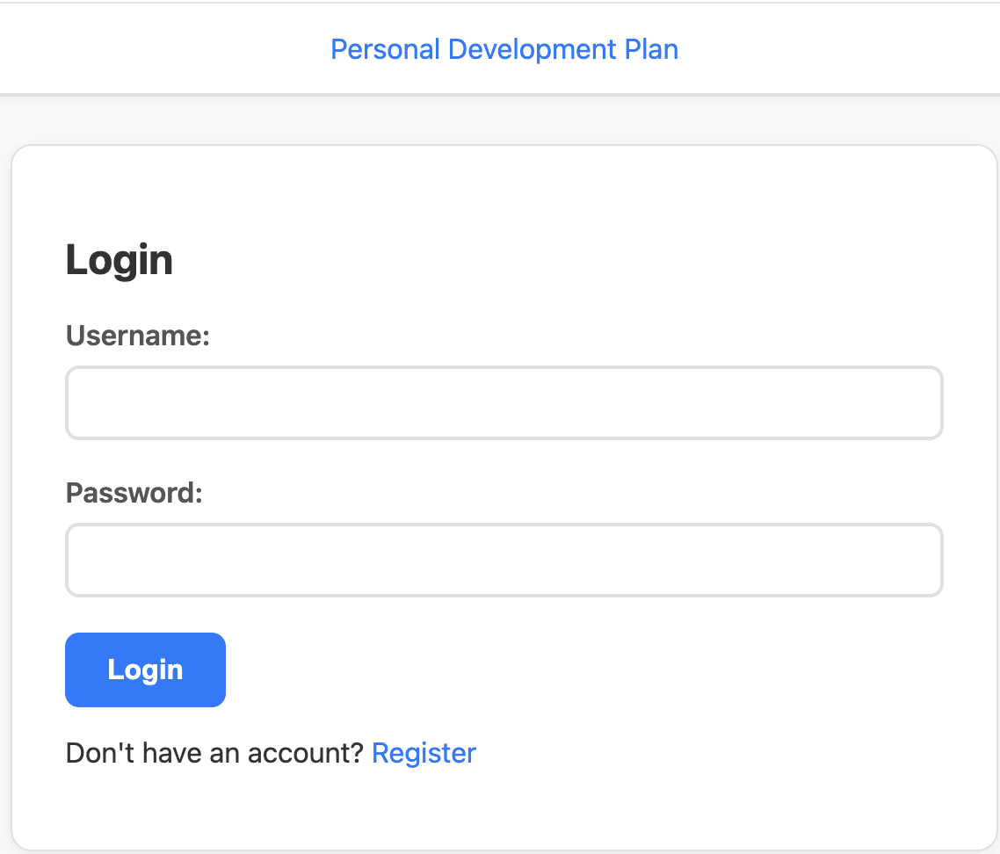
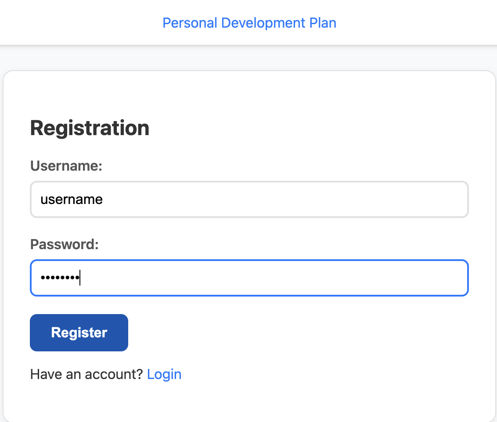
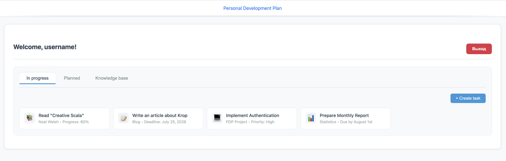

# Htmx: Building an Authorization Application

This example demonstrates how to build a complete authorization application using Krop with [HTMX][htmx] for dynamic interactions. 
The application implements user registration, login, logout, and session management — 
all while following Krop's principles of type safety and composability. 
It also showcases a task management interface with tabbed navigation as an example of authenticated content.

## Overview

The application provides a full user authentication flow:

- **Login page** – Users can sign in with their credentials
  
- **Registration page** – New users can create an account
  
- **Authenticated dashboard** – After login, users see a personalized welcome page with task management tabs
  
- **Session management** – User tokens are stored in cookies for persistent sessions
- **Secure logout** – Users can safely end their session

## Code Structure

The example is organized into several logical components that work together seamlessly:

### Models

The `LoginRequest` case class defines the data structure for authentication requests, 
using Circe's derivation support for JSON encoding and decoding. 
This model is shared across the registration and login flows.

```scala
package krop.examples.htmx.models

import io.circe.*
import krop.route.FormCodec

final case class LoginRequest(
    username: String,
    password: String
) derives Decoder,
      Encoder,
      FormCodec
```

### Routes

The `Routes` object defines all the application's endpoints using Krop's routing DSL. Each route specifies:

- The HTTP method (GET, POST)
- The URL path pattern
- Request extraction (headers, body parsing)
- Response handling with appropriate status codes

The routes support:

- Static pages (`/`, `/home`, `/register`)
- Authentication actions (`/auth/login`, `/auth/logout`)
- User creation (`/new_user`)
- Static asset serving (`/asset/*`)

```scala
package krop.examples.htmx.routes

import krop.all.*
import krop.examples.htmx.models.LoginRequest
import org.http4s.Status as HttpStatus
import org.http4s.headers.*

object Routes:
  val index =
    Route(
      Request.get(Path.root).extractHeader[`Cookie`],
      Response.ok(Entity.html)
    )

  val home =
    Route(
      Request.get(Path.root / "home").extractHeader[`Cookie`],
      Response.ok(Entity.html)
    )

  val register =
    Route(
      Request.get(Path.root / "register"),
      Response.ok(Entity.html)
    )

  val login = Route(
    Request
      .post(Path.root / "auth" / "login")
      .withEntity(Entity.formOf[LoginRequest]),
    Response
      .ok(Entity.html)
      .orElse(Response.status(HttpStatus.Ok, Entity.html))
      .orNotFound
  )

  val newUser = Route(
    Request
      .post(Path.root / "new_user")
      .withEntity(Entity.formOf[LoginRequest]),
    Response
      .status(HttpStatus.Created, Entity.html)
      .orElse(Response.status(HttpStatus.Ok, Entity.html))
      .orNotFound
  )

  val logout = Route(
    Request
      .post(Path.root / "auth" / "logout")
      .extractHeader[Authorization],
    Response
      .ok(Entity.html)
      .orElse(Response.status(HttpStatus.Ok, Entity.html))
      .orNotFound
  )

  val assetRoute =
    Route(
      Request.get(Path.root / "asset" / Params.separatedString("/")),
      Response.staticResource("/asset/")
    )
end Routes
```

### Views

The application uses Twirl templates for server-side rendering. The view layer is organized as:

#### base.scala.html

**`base.scala.html`** – The main layout template that includes the HTMX script, common styles, and navigation structure.
It uses `hx-get` and `hx-target` attributes to enable HTMX's dynamic page updates without full reloads.

```html
@(title: String, content: Html)
<!DOCTYPE html>
<html lang="en">
<head>
    <meta charset="utf-8"/>
    <meta name="viewport" content="width=device-width, initial-scale=1"/>
    <title>@title</title>

    <link rel="stylesheet" href="/asset/htmx-example.css" />
    <script src="/asset/htmx-example.js"></script>
    <script src="@{"https://cdn.jsdelivr.net/npm/htmx.org@2.0.10/dist/htmx.js"}" integrity="sha384-Q+Dky3iHVJOr6wUjQ4ulh6uQ76an/t+ak1+PjMVaxRjbZamFLAG+u9InkfjbsEQf" crossorigin="anonymous"></script>
</head>
<body>
<header class="app-header">
    <div class="header-container">
        <a
                hx-get="/home"
                hx-target="#app"
                hx-swap="outerHTML"
        >@title</a>
    </div>
    <div class="header-divider"></div>
</header>

<main class="main-content">
    @content
</main>
</body>
</html>
```

#### login.scala.html

**`login.scala.html`** – The login form with username and password fields. 
Error messages are displayed conditionally, and the form uses `hx-post` handler to submit via fetch.

```html
@(errorMessage: Option[String])
<div id="app" class="app-container-narrow">
  <h2>Login</h2>

  <form id="loginForm">
    <div class="form-group">
      <label for="loginUsername">Username:</label>
      <input id="loginUsername" name="username" type="text" required/>
    </div>
    <div class="form-group">
      <label for="loginPassword">Password:</label>
      <input id="loginPassword" name="password" type="password" required/>
    </div>
    <button
            type="button"
            hx-post="/auth/login"
            hx-target="#app"
            hx-swap="outerHTML"
    >Login
    </button>
  </form>

  <div id="messageBlock">
    @errorMessage.map { msg =>
    <div class="error">@msg</div>
    }
  </div>

  <p>
    Don't have an account?
    <a
            onclick="htmx.process(this); this.click();"
            hx-get="/register"
            hx-target="#app"
            hx-swap="outerHTML"
    >Register</a>
  </p>
</div>
```

#### register.scala.html

**`register.scala.html`** – The registration form, similar to the login page but for new user creation.

```html
@(errorMessage: Option[String])
<div id="app" class="app-container-narrow">
  <h2>Registration</h2>

  <form id="registerForm">
    <div class="form-group">
      <label for="username">Username:</label>
      <input id="username" name="username" type="text" required/>
    </div>
    <div class="form-group">
      <label for="password">Password:</label>
      <input id="password" name="password" type="password" required/>
    </div>
    <button
            type="button"
            hx-post="/new_user"
            hx-target="#app"
            hx-swap="outerHTML"
    >Register
    </button>
  </form>

  <div id="messageBlock">
    @errorMessage.map { msg =>
    <div class="error">@msg</div>
    }
  </div>

  <p>
    Have an account?
    <a
            onclick="htmx.process(this); this.click();"
            hx-get="/home"
            hx-target="#app"
            hx-swap="outerHTML"
    >Login</a>
  </p>
</div>
```

#### welcome.scala.html

**`welcome.scala.html`** – The authenticated user dashboard. This template:

- Displays the user's name and logout button
- Implements three tabbed sections: "In progress", "Planned", and "Knowledge base"
- Shows example tasks in each tab
- Includes `saveUserCookies` script to extract and store the session token

```html
@(username: String, token: String)
<div id="app" class="app-container">
    <iframe onload="saveUserCookies('@token')" style="display:none;"></iframe>
    <div id="welcomeBlock" class="welcome-container"
         data-token="@token">
        <div class="welcome-header">
            <div class="welcome-user">
                <h2>Welcome, @username!</h2>
            </div>
            <button
                    id="logoutBtn"
                    type="button"
                    onclick="clearUserCookies(); htmx.process(this); this.click();"
                    hx-post="/auth/logout"
                    hx-target="#app"
                    hx-swap="outerHTML"
                    hx-headers='{"Authorization": "Bearer @token"}'
                    class="logout-btn"
            >
                Выход
            </button>
        </div>

        <div class="tabs-container">
            <div class="tabs-header">
                <button class="tab-btn active" data-tab="in-progress" onclick="switchTab('in-progress')">
                    In progress
                </button>
                <button class="tab-btn" data-tab="planned" onclick="switchTab('planned')">
                    Planned
                </button>
                <button class="tab-btn" data-tab="knowledge" onclick="switchTab('knowledge')">
                    Knowledge base
                </button>
            </div>

            <div id="tab-in-progress" class="tab-content active">
                ... // Mocks
            </div>

            <div id="tab-planned" class="tab-content">
                ... // Mocks
            </div>

            <div id="tab-knowledge" class="tab-content">
                ... // Mocks
            </div>
        </div>

        <div id="messageBlock"></div>
    </div>
</div>
```

### Assets

The JavaScript file manages client-side interactions:

- **Cookie management** – Functions to set, get, and delete cookies for storing the authentication token
- **Tab switching** – `switchTab()` manages the task tabs on the dashboard
- **HTMX integration** – Automatically attaches the authentication token to all HTMX requests via the `htmx:beforeRequest` event listener

```javascript
document.addEventListener('htmx:beforeRequest', function(event) {
  var token = getCookie('token');
  if (token) {
    event.detail.xhr.setRequestHeader('Authorization', 'Bearer ' + token);
  }
});

function setCookie(name, value, days) {
  days = days || 7;
  var expires = new Date();
  expires.setTime(expires.getTime() + days * 24 * 60 * 60 * 1000);
  document.cookie = name + "=" + encodeURIComponent(value) +
          "; expires=" + expires.toUTCString() +
          "; path=/";
}

function getCookie(name) {
  var nameEQ = name + "=";
  var ca = document.cookie.split(';');
  for(var i = 0; i < ca.length; i++) {
    var c = ca[i];
    while (c.charAt(0) === ' ') c = c.substring(1, c.length);
    if (c.indexOf(nameEQ) === 0) return decodeURIComponent(c.substring(nameEQ.length, c.length));
  }
  return null;
}

function deleteCookie(name) {
  document.cookie = name + '=; expires=Thu, 01 Jan 1970 00:00:00 UTC; path=/;';
}

function saveUserCookies(token) {
  if (token) {
    setCookie('token', token);
  }
}

function clearUserCookies() {
  deleteCookie('token');
}

function switchTab(tabId) {
  document.querySelectorAll('.tab-btn').forEach(btn => btn.classList.remove('active'));
  document.querySelectorAll('.tab-content').forEach(content => content.classList.remove('active'));

  document.querySelector(`.tab-btn[data-tab="${tabId}"]`).classList.add('active');
  document.getElementById(`tab-${tabId}`).classList.add('active');
}
```

### Server

The `SimpleAuthService` trait defines the authentication contract with three operations:

- `findUser(token)` – Retrieves user information from a stored token
- `login(username, password)` – Validates credentials and returns user info
- `newUser(username, password)` – Creates a new user account

The in-memory implementation demonstrates how to store and query user data, using a `Ref[IO, Vector[UserInfo]]` 
for thread-safe state management. 
This is a simplified demonstration; in production, you would replace this with a proper database.

```scala
package krop.examples.htmx.server

import cats.effect.IO
import cats.effect.Ref
import krop.examples.htmx.server.SimpleAuthService.UserInfo

import java.util.UUID

/** !!!Just for the demonstration!!! */
trait SimpleAuthService[F[_]]:
  def findUser(token: String): F[Option[UserInfo]]

  def login(username: String, password: String): F[Option[UserInfo]]

  def newUser(username: String, password: String): F[Either[String, UserInfo]]

object SimpleAuthService:
  final case class UserInfo(username: String, password: String, token: String)

  def make(db: Ref[IO, Vector[UserInfo]]): SimpleAuthService[IO] =
    new SimpleAuthService:
      def findUser(token: String): IO[Option[UserInfo]] =
        db.get.map(_.find(_.token == token))

      def login(username: String, password: String): IO[Option[UserInfo]] =
        db.get.map(
          _.find(user => user.username == username && user.password == password)
        )

      def newUser(
          username: String,
          password: String
      ): IO[Either[String, UserInfo]] = {
        val newUser = UserInfo(username, password, UUID.randomUUID().toString)

        db.get.flatMap:
          case users if users.exists(_.username == username) =>
            IO.pure(Left("A user with such username already exists."))
          case users =>
            db.update(users => newUser +: users).as(Right(newUser))
      }
```

### Handlers

Each route has a corresponding handler that processes requests and generates responses:

- **`InitialHandler`** – Handles the root path (`/`), checking for existing sessions and either showing the login page or redirecting to the dashboard
- **`HomeHandler`** – Serves the home endpoint, similarly checking for valid sessions
- **`RegisterHandler`** – Serves the registration form
- **`LoginHandler`** – Processes login credentials, returning either the welcome page or an error message
- **`LogoutHandler`** – Validates the token and logs out the user
- **`NewUserHandler`** – Processes registration requests, handling both success and conflict cases

All handlers use Krop's `handleIO` method for effectful computations, with proper error handling and logging.

#### Create Parser

```scala
package krop.examples.htmx.handlers

import org.http4s.headers.Cookie

object Parser:
  extension (cookie: Cookie)
    def getToken: Option[String] =
      cookie.values.collectFirst:
        case rq if rq.name == "token" => rq.content
```

#### InitialHandler

```scala
package krop.examples.htmx.handlers

import cats.effect.IO
import cats.syntax.all.*
import krop.all.*
import krop.examples.htmx.handlers.Parser.*
import krop.examples.htmx.routes.Routes
import krop.examples.htmx.server.SimpleAuthService
import krop.examples.htmx.views.html
import org.http4s.headers.Cookie
import org.typelevel.log4cats.Logger

final case class InitialHandler(
    service: SimpleAuthService[IO]
)(using Logger[IO]):
  private val name = "Personal Development Plan"

  private val defaultPage =
    html.base(name, html.login(None)).toString

  val handler: Handler =
    Routes.index.handleIO: (cookie: Cookie) =>
      cookie.getToken match
        case Some(token) =>
          service
            .findUser(token)
            .map:
              case Some(user) =>
                html
                  .base(name, html.welcome(user.username, token))
                  .toString
              case None =>
                defaultPage
            .recoverWith:
              case ex =>
                Logger[IO]
                  .error(ex)(s"Server error: ${ex.getMessage}")
                  .as(defaultPage)
        case None =>
          defaultPage.pure[IO]
end InitialHandler
```

#### HomeHandler

```scala
package krop.examples.htmx.handlers

import cats.effect.IO
import cats.syntax.all.*
import krop.all.*
import krop.examples.htmx.handlers.Parser.*
import krop.examples.htmx.routes.Routes
import krop.examples.htmx.server.SimpleAuthService
import krop.examples.htmx.views.html
import org.http4s.headers.Cookie
import org.typelevel.log4cats.Logger

final case class HomeHandler(
    service: SimpleAuthService[IO]
)(using Logger[IO]):
  private val defaultPage = html.login(None).toString

  val handler: Handler =
    Routes.home.handleIO: (cookie: Cookie) =>
      cookie.getToken match
        case Some(token) =>
          service
            .findUser(token)
            .map:
              case Some(user) =>
                html.welcome(user.username, token).toString
              case None =>
                defaultPage
            .recoverWith:
              case ex =>
                Logger[IO]
                  .error(ex)(s"Server error: ${ex.getMessage}")
                  .as(defaultPage)
        case None =>
          defaultPage.pure[IO]
end HomeHandler
```

#### RegisterHandler

```scala
package krop.examples.htmx.handlers

import krop.all.*
import krop.examples.htmx.routes.Routes
import krop.examples.htmx.views.html

object RegisterHandler:
  val handler: Handler =
    Routes.register.handle { () =>
      html.register(None).toString
    }
```

#### LoginHandler

```scala
package krop.examples.htmx.handlers

import cats.effect.IO
import cats.syntax.all.*
import krop.all.*
import krop.examples.htmx.models.LoginRequest
import krop.examples.htmx.routes.Routes
import krop.examples.htmx.server.SimpleAuthService
import krop.examples.htmx.views.html
import org.typelevel.log4cats.Logger

final case class LoginHandler(
    service: SimpleAuthService[IO]
)(using Logger[IO]):
  val handler: Handler =
    Routes.login.handleIO { (request: LoginRequest) =>
      service
        .login(request.username, request.password)
        .map:
          case Some(user) =>
            html.welcome(user.username, user.token).toString.asRight.some
          case None =>
            html.login("User not found".some).toString.asLeft.some
        .recoverWith:
          case ex =>
            Logger[IO].error(ex)(s"Server error: ${ex.getMessage}").as(none)
    }
end LoginHandler
```

#### LogoutHandler

```scala
package krop.examples.htmx.handlers

import cats.effect.IO
import cats.syntax.all.*
import krop.all.*
import krop.examples.htmx.routes.Routes
import krop.examples.htmx.server.SimpleAuthService
import krop.examples.htmx.views.html
import org.http4s.AuthScheme
import org.http4s.Credentials.Token
import org.http4s.headers.Authorization
import org.typelevel.log4cats.Logger

final case class LogoutHandler(
    service: SimpleAuthService[IO]
)(using Logger[IO]):
  val handler: Handler =
    Routes.logout.handleIO: (authorization: Authorization) =>
      authorization match
        case Authorization(Token(AuthScheme.Bearer, token)) =>
          service
            .findUser(token)
            .map:
              case Some(_) =>
                html.login(none).toString.asRight.some
              case None =>
                html.login("User not found".some).toString.asLeft.some
        case _ =>
          html
            .login("An authorization error occurred".some)
            .toString
            .asLeft
            .some
            .pure[IO]
end LogoutHandler
```

#### NewUserHandler

```scala
package krop.examples.htmx.handlers

import cats.effect.IO
import cats.syntax.all.*
import krop.all.*
import krop.examples.htmx.models.LoginRequest
import krop.examples.htmx.routes.Routes
import krop.examples.htmx.server.SimpleAuthService
import krop.examples.htmx.views.html
import org.typelevel.log4cats.Logger

final case class NewUserHandler(
    service: SimpleAuthService[IO]
)(using Logger[IO]):
  val handler: Handler =
    Routes.newUser.handleIO { (request: LoginRequest) =>
      service
        .newUser(request.username, request.password)
        .map:
          case Right(user) =>
            html.welcome(user.username, user.token).toString.asRight.some
          case Left(error) =>
            html.register(error.some).toString.asLeft.some
        .recoverWith:
          case ex =>
            Logger[IO].error(ex)(s"Server error: ${ex.getMessage}").as(none)
    }
end NewUserHandler
```

### Main

The `Main` object is the application entry point. It:

1. Creates a logger instance
2. Initializes the in-memory user database
3. Composes all routes together using `orElse`
4. Builds and runs the server on the default port

```scala
package krop.examples.htmx

import cats.effect.*
import krop.all.*
import krop.examples.htmx.handlers.*
import krop.examples.htmx.server.SimpleAuthService
import krop.examples.htmx.server.SimpleAuthService.UserInfo
import org.typelevel.log4cats.Logger
import org.typelevel.log4cats.slf4j.Slf4jLogger

val name = "Personal Development Plan"

object Main extends IOApp:
  given Logger[IO] = Slf4jLogger.getLogger[IO]

  def application(db: Ref[IO, Vector[UserInfo]]): Application =
    val service: SimpleAuthService[IO] =
      SimpleAuthService.make(db)

    val initialHandler = InitialHandler(service)
    val homeHandler = HomeHandler(service)
    val loginHandler = LoginHandler(service)
    val logoutHandler = LogoutHandler(service)
    val newUserHandler = NewUserHandler(service)
    val assetRoute =
      Route(
        Request.get(Path.root / "asset" / Params.separatedString("/")),
        Response.staticResource("/asset/")
      )

    initialHandler.handler
      .orElse(homeHandler.handler)
      .orElse(RegisterHandler.handler)
      .orElse(loginHandler.handler)
      .orElse(logoutHandler.handler)
      .orElse(newUserHandler.handler)
      .orElse(assetRoute.passthrough)
      .orElse(Application.notFound)

  override def run(args: List[String]): IO[ExitCode] =
    Ref[IO]
      .of(Vector.empty[UserInfo])
      .flatMap: db =>
        ServerBuilder.default
          .withApplication(application(db))
          .build
          .toIO
          .as(ExitCode.Success)
```

## Using the Application

1. Start the application by running the `Main` class
2. Open your browser and navigate to `http://localhost:8080/`
3. You'll see the login page. Use the "Register" link to create a new account
4. After registration or login, you'll be redirected to your personalized dashboard
5. Explore the task tabs, use the logout button, or switch between accounts

## Conclusion

This example demonstrates how Krop's design enables you to build complete, type-safe web applications 
with modern frontend interactions using [HTMX][htmx]. 
By combining Krop's routing, request handling, and response composition with HTMX's dynamic capabilities, 
you can create rich user experiences while maintaining clean separation of concerns and functional programming principles.

The full source code is available in the Krop [examples directory][source].

[htmx]: https://htmx.org/
[source]: https://github.com/creativescala/krop/tree/main/examples/src/main
